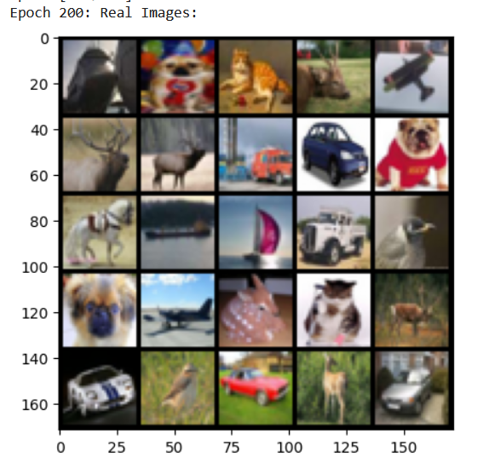
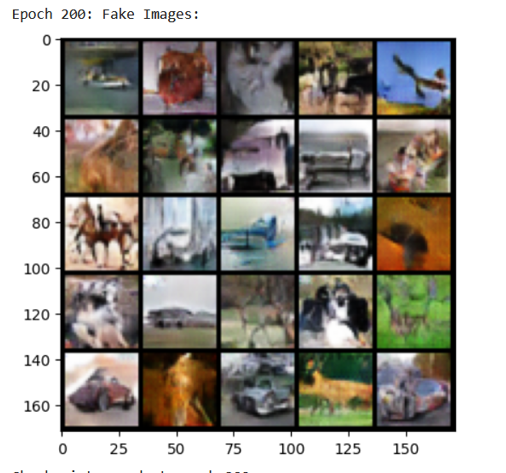
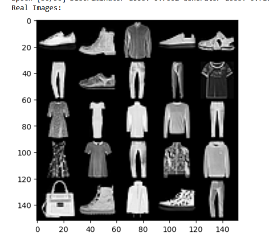
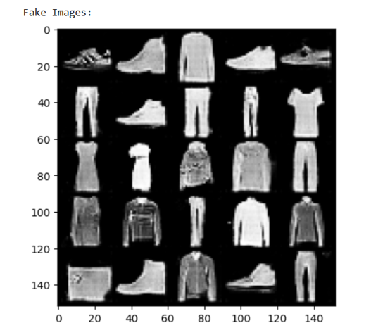
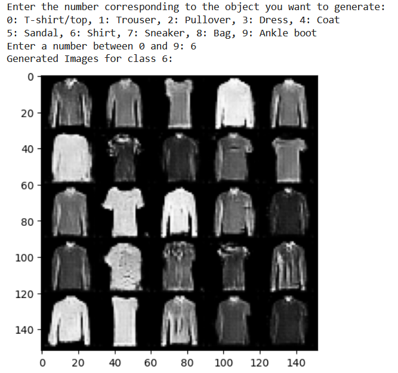
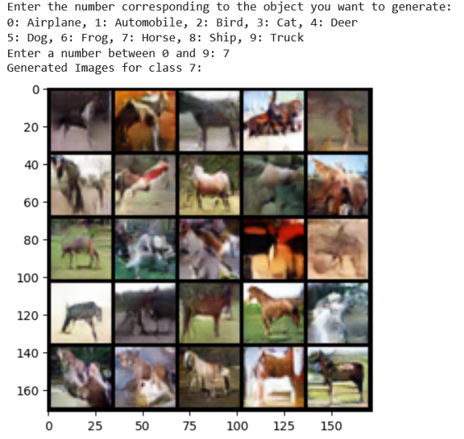

# Generative adverserial networks project

This project consists of two Generative Adversarial Networks (GANs) that are implemented using PyTorch: one for the CIFAR-10 dataset and one for the Fashion-MNIST dataset. These GANs have been built from scratch and trained to generate realistic-looking images from each respective dataset.

The project includes the following files:
- `gan_cifar_10.ipynb`: Jupyter Notebook containing the GAN implementation for CIFAR-10.
- `gan_fashion_mnist.ipynb`: Jupyter Notebook containing the GAN implementation for Fashion-MNIST.

## Overview

Generative Adversarial Networks (GANs) are a class of neural networks used for unsupervised learning. They consist of two competing models: a Generator and a Discriminator.

- **Generator**: The generator takes random noise as input and generates new data instances that resemble the training data.
- **Discriminator**: The discriminator evaluates whether a given data instance is real (from the training set) or fake (generated by the generator).

The two models are trained together in a zero-sum game where the generator tries to generate data that fools the discriminator, while the discriminator tries to distinguish between real and fake data.

### Project Structure

- **CIFAR-10 GAN (`gan_cifar_10.ipynb`)**: This GAN is trained to generate realistic images from the CIFAR-10 dataset, which contains 60,000 32x32 color images in 10 different classes.
- **Fashion-MNIST GAN (`gan_fashion_mnist.ipynb`)**: This GAN is trained to generate realistic images from the Fashion-MNIST dataset, which consists of 70,000 grayscale images of clothing items from 10 different classes.

## Training Process

### Common Steps

1. **Import Libraries**: 
   - Both GANs use PyTorch for building and training models. Libraries such as `torchvision` are used for data loading and transformation, and `tqdm` is used for monitoring training progress.

2. **Define Generator and Discriminator**:
   - Both implementations have separate classes for the Generator and Discriminator models.
   - The Generator is responsible for creating fake images from random noise.
   - The Discriminator is used to distinguish between real images and fake images generated by the Generator.

3. **Data Preparation**:
   - **CIFAR-10 GAN**: Uses the CIFAR-10 dataset, with images normalized to a range between -1 and 1 for better training stability.
   - **Fashion-MNIST GAN**: Uses the Fashion-MNIST dataset, also normalized to the range between -1 and 1.

4. **Training Parameters**:
   - A latent dimension (`latent_dim`) is used to generate random noise, which is fed to the Generator.
   - The Discriminator and Generator are trained using the Adam optimizer with specific learning rates (`0.0002`) and betas (`(0.5, 0.999)`).

5. **Training Loop**:
   - Both GANs are trained for a specified number of epochs. The **CIFAR-10 GAN** is trained for **200 epochs**, while the **Fashion-MNIST GAN** is trained for **50 epochs**.
   - For each batch, the Discriminator is updated with both real and fake images, followed by updating the Generator.
   - A binary cross-entropy loss (`BCELoss` or `BCEWithLogitsLoss`) is used to train the models.

6. **Loss Tracking and Image Display**:
   - The loss for both the Generator and the Discriminator is logged and displayed after each epoch.
   - Images generated by the Generator are displayed at various intervals during training to visually monitor the progress.

### Key Differences Between CIFAR-10 and Fashion-MNIST GANs

1. **Dataset and Image Size**:
   - CIFAR-10 contains **32x32** color images, while Fashion-MNIST contains **28x28** grayscale images.
   - The input dimension and the number of image channels vary based on the dataset: 3 for CIFAR-10 and 1 for Fashion-MNIST.

2. **Training Epochs**:
   - **CIFAR-10 GAN** is trained for **200 epochs**, while **Fashion-MNIST GAN** is trained for **50 epochs**.
   - The difference in the number of epochs allows the CIFAR-10 model to learn the more complex structures of color images, whereas the Fashion-MNIST dataset is simpler, thus requiring fewer epochs.

3. **Generator and Discriminator Architectures**:
   - Although the basic structure is similar, the architecture of each model has been adjusted to suit the specific dataset in terms of image size and complexity.

## Testing Process (Image Generation)

The testing process involves generating images using a trained Generator. You can choose to generate images by running either of the notebooks:

1. **Run the Notebook**: Open either `gan_cifar_10.ipynb` or `gan_fashion_mnist.ipynb` in Jupyter Notebook or Google Colab.
2. **Load the Pre-trained Generator**:
   - If weights are saved during training, load the weights for the desired epoch.
3. **Generate Images**:
   - For **CIFAR-10**, the user can input a class (e.g., `0` for airplane, `1` for automobile, etc.).
   - For **Fashion-MNIST**, the user can input a class (e.g., `0` for T-shirt/top, `1` for trouser, etc.).
   - The generator creates a batch of images based on random noise and the selected class label.

### Example Images

Below are examples of real and fake images generated at the end of training:

#### CIFAR-10 GAN (Epoch 200)
- **Real Images**:
 

  
- **Fake Images**:
  

#### Fashion-MNIST GAN (Epoch 50)
- **Real Images**:
  

- **Fake Images**:

### Generated Images During Inference
- **Fashion-MNIST GAN**:
  

  
- **CIFAR-10 GAN**:

## Future Improvements

- **Training Time**: Increase the number of epochs for better image quality for the CIFAR-10 dataset.
- **Architecture Optimization**: Experiment with more advanced architectures (e.g., DCGAN, StyleGAN).
- 
## Contributing

If you would like to contribute to the project, feel free to fork the repository, make changes, and submit a pull request. Contributions are always welcome!
